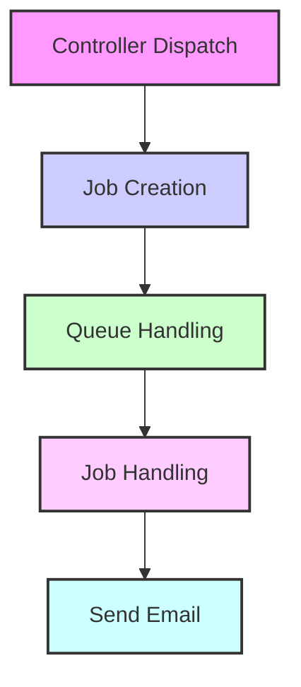

# [Gathered by cupent](https://www.cupent.com)
Create Date: 13-09-2024
Last Update Date: 13-09-2024
# Guide: Dispatching Jobs in Laravel

This guide explains the basic flow of dispatching a job in Laravel, from configuring the queue driver to sending an email via a queued job.

---

## Flow Overview

The process involves the following steps:

1. **Controller Dispatch**: The controller initiates the job dispatch when an action is triggered (e.g., button click).
2. **Job Creation**: A new job instance is created and added to the queue.
3. **Queue Handling**: The job is placed in the queue and waits to be processed.
4. **Job Handling**: The job handler takes over and executes the logic, such as sending an email.

---

## Flow Diagram



## Basic Queue Handling and Sending Emails in Laravel

### 1. Choose and Configure Queue Driver

#### Step 1: Choose a Queue Driver

Laravel supports various queue drivers such as database, Redis, and more. For simplicity, we'll use the database driver.

#### Step 2: Configure Queue Driver in `.env`

Set up the queue driver in your `.env` file:

```dotenv
QUEUE_CONNECTION=database

```
#### Step 3: Configure Queue Driver in `config/queue.php`

In the `config/queue.php` file, ensure that the default queue connection is set to `database`:

```php
'default' => env('QUEUE_CONNECTION', 'database'),

```

### 2. Configuring Email Settings in Laravel

To configure email settings in your Laravel application, follow these steps:

#### Step 1:  Open Your `.env` File

Locate the `.env` file in the root of your Laravel project.

#### Step 2:  Add Email Configuration Settings

Add the following lines to your `.env` file, updating them with your email service provider's details:

```dotenv
MAIL_MAILER=smtp
MAIL_HOST=smtp.example.com
MAIL_PORT=587
MAIL_USERNAME=your_email@example.com
MAIL_PASSWORD=your_email_password
MAIL_ENCRYPTION=tls
MAIL_FROM_ADDRESS=your_email@example.com
MAIL_FROM_NAME="${APP_NAME}"

`````
Configuration Parameters:

    MAIL_MAILER: Set this to the email driver you want to use (smtp, sendmail, mailgun, postmark, etc.).
    MAIL_HOST: The SMTP server address (e.g., smtp.example.com).
    MAIL_PORT: The port used by the SMTP server (e.g., 587 for TLS).
    MAIL_USERNAME: Your email address or username for SMTP authentication.
    MAIL_PASSWORD: Your email account password or SMTP authentication password.
    MAIL_ENCRYPTION: Encryption protocol used by the mail server (tls or ssl).
    MAIL_FROM_ADDRESS: The email address that will appear as the sender.
    MAIL_FROM_NAME: The name that will appear as the sender.

#### Step 3:  Add Email Configuration Settings Clear Configuration Cache

To ensure Laravel picks up the new settings, run the following command:

```bash

php artisan config:cache
```

### 3.  Creating a Job Table in Laravel

To create and set up a job table for handling queued jobs in Laravel, follow these steps:

#### Step 1: Generate the Migration for the Jobs Table

Run the following Artisan command to generate a migration file for the `jobs` table:

```bash
php artisan queue:table

php artisan migrate
```

##### 1. `jobs` Table

The `jobs` table is used to store queued jobs that are pending execution. Here is the schema for the `jobs` table:

| Column         | Type          | Description                                        |
|----------------|---------------|----------------------------------------------------|
| `id`           | `bigint`       | Primary key                                        |
| `queue`        | `varchar`      | The name of the queue                             |
| `payload`      | `text`         | Serialized job data                               |
| `attempts`     | `int`          | Number of attempts                                |
| `reserved_at`  | `timestamp`    | Timestamp when the job was reserved               |
| `available_at` | `timestamp`    | Timestamp when the job becomes available          |
| `created_at`   | `timestamp`    | Timestamp when the job was created                |
| `updated_at`   | `timestamp`    | Timestamp when the job was last updated           |

##### 2. `failed_jobs` Table

The `failed_jobs` table is used to store jobs that have failed to execute. Here is the schema for the `failed_jobs` table:

| Column         | Type          | Description                                        |
|----------------|---------------|----------------------------------------------------|
| `id`           | `bigint`       | Primary key                                        |
| `connection`   | `text`         | The connection used for the job                   |
| `queue`        | `text`         | The name of the queue                             |
| `payload`      | `text`         | Serialized job data                               |
| `exception`    | `text`         | The exception that caused the job to fail         |
| `failed_at`    | `timestamp`    | Timestamp when the job failed                     |

---

These tables help manage and monitor the status of jobs in Laravel’s queue system.

### 4 .Create a Job Class

Generate a new job class using Artisan:

```bash
php artisan make:job SendEmailJob
php artisan make:job SendQuotationEmailToVendors
```

Edit the job class to handle the email sending logic. Here’s a basic example:

```php
<?php

namespace App\Jobs;

use Barryvdh\DomPDF\PDF;
use App\Mail\QuotationEmail;
use Illuminate\Bus\Queueable;
use Illuminate\Support\Facades\DB;
use Illuminate\Support\Facades\Log;
use Illuminate\Support\Facades\Mail;
use Illuminate\Queue\SerializesModels;
use Illuminate\Queue\InteractsWithQueue;
use Illuminate\Contracts\Queue\ShouldQueue;
use Illuminate\Foundation\Bus\Dispatchable;
use App\Jobs\Middleware\UpdateJobTypeMiddleware;


class SendQuotationEmailToVendors implements ShouldQueue
{
    use Dispatchable, InteractsWithQueue, Queueable, SerializesModels;

    protected $from;
    protected $to;
    protected $cc;
    protected $subject;
    protected $body;
    protected $signature;
    protected $productList;
    protected $organisationDetails;
    protected $quotation_numberEmail;
    protected  $vendor_name;
    protected  $vendor_id;
    protected  $vendor_phone_number;
    protected $address_1;
    protected $address_2;
    protected $country;
    protected $city;
    protected $state;
    protected $pincode;


    // Set the number of attempts before failing
    public $tries = 5;

    // Set the delay in seconds between retries
    public $backoff = 60;


    /**
     * Create a new job instance.
     */
    public function __construct(
        $from,
        $to,
        $cc,
        $subject,
        $body,
        $signature,
        $productList,
        $organisationDetails,
        $quotation_numberEmail,
        $vendor_name,
        $vendor_id,
        $vendor_phone_number,
        $address_1,
        $address_2,
        $country,
        $city,
        $state,
        $pincode
    ) {
        $this->from = $from;
        $this->to = $to;
        $this->cc = $cc;
        $this->subject = strip_tags($subject);
        $this->body = $body;
        $this->signature = $signature;
        $this->productList = $productList;
        $this->organisationDetails = $organisationDetails;
        $this->quotation_numberEmail = $quotation_numberEmail;
        $this->vendor_name = $vendor_name;
        $this->vendor_id = $vendor_id;
        $this->vendor_phone_number = $vendor_phone_number;
        $this->address_1 = $address_1;
        $this->address_2 = $address_2;
        $this->vendor_phone_number = $vendor_phone_number;
        $this->country = $country;
        $this->city = $city;
        $this->state = $state;
        $this->pincode = $pincode;
    }

    /**
     * Execute the job.
     */
    public function handle(PDF $pdf)
    {
        // Generate the PDF only once if the content is the same for all recipients
        $generatedPdf = $pdf->loadView('emails.quotation_email_attchment', [
            'productList' => $this->productList,
            'organisationDetails' => $this->organisationDetails,
            'quotation_numberEmail' => $this->quotation_numberEmail,
            'vendor_name' => $this->vendor_name,
            'vendor_id' => $this->vendor_id,
            'vendor_phone_number' => $this->vendor_phone_number,
            'address_1' => $this->address_1,
            'address_2' => $this->address_2,
            'country' => $this->country,
            'city' => $this->city,
            'state' => $this->state,
            'pincode' => $this->pincode,
        ]);

        // Define a path for the generated PDF
        $pdfPath = storage_path('app/public/quotation_' . $this->quotation_numberEmail . '.pdf');

        // Save the generated PDF to the defined path
        $generatedPdf->save($pdfPath);

        // Split the 'to' field by comma and trim whitespace
        $recipients = array_map('trim', explode(',', $this->to));

        // Iterate through each recipient and send the email with the attached PDF
        foreach ($recipients as $recipient) {
            try {
                // Send the email using Laravel's Mail facade
                Mail::to($recipient)->send(new QuotationEmail($this->subject, $this->body, $this->signature, $pdfPath));
            } catch (\Exception $e) {
                // Log the exception or handle it as needed
                Log::error('Failed to send email to ' . $recipient . ': ' . $e->getMessage());
            }
        }

        // Unlink the file only once after sending all emails
        unlink($pdfPath);
    }


    public function failed(\Exception $exception)
    {
        // Log the error or perform other actions when the job fails
        Log::error('Failed to send quotation email: ' . $exception->getMessage());

        // You can also notify the admin, send alerts, etc.
    }

    public function setJobType($type)
    {
        DB::table('jobs')->where('id', $this->job->getJobId())->update(['job_type' => $type]);
    }

    public function middleware()
    {
        return [new UpdateJobTypeMiddleware];
    }
}

```

### 5 .Create a  Dispatching a Job From Controller

In this example, we are dispatching a job to send a quotation email to vendors. The job is sent to a specific queue named `sending-quotation-to-vendors`. Here's the code used for dispatching the job:

```php
dispatch(new SendQuotationEmailToVendors(
    $from,
    $recipient, // Pass the individual recipient here
    $cc,
    $subject,
    $body,
    $signature,
    $productList,
    $organisationDetails, 
    $quotation_numberEmail,
    $vendor_name,
    $vendor_id,
    $vendor_phone_number,
    $address_1,
    $address_2,
    $country,
    $city,
    $state,
    $pincode
))->onQueue('sending-quotation-to-vendors');
````


### 6 .Creating Middleware to Update Job Type

The purpose of this middleware is to set the job type for specific jobs while they are being processed. This is particularly useful for categorizing or tagging jobs with additional information.

##### Middleware Code

Create a middleware class named `UpdateJobTypeMiddleware` in the `App\Jobs\Middleware` namespace. The following code demonstrates how to set the job type when the job is being processed:

```php
<?php

namespace App\Jobs\Middleware;

use Closure;

class UpdateJobTypeMiddleware
{
    public function handle($job, Closure $next)
    {
        // Set the job type when the job is being processed
        if (method_exists($job, 'setJobType')) {
            $job->setJobType('Email');
        }

        return $next($job);
    }
}

```
### 7 .Creating A  Mailable Class Named QuotationEmail for emailing purpose

The `QuotationEmail` class is a mailable used for sending quotation emails in a Laravel application. It leverages Laravel's mailable functionality to handle email composition and sending.

##### Mailable Class Code

```php
<?php

namespace App\Mail;

use Illuminate\Bus\Queueable;
use Illuminate\Mail\Mailable;
use Illuminate\Queue\SerializesModels;

class QuotationEmail extends Mailable
{
    use Queueable, SerializesModels;

    public $subject;
    public $body;
    public $signature;
    public $attachmentPath;

    /**
     * Create a new message instance.
     */
    public function __construct($subject, $body, $signature, $attachmentPath)
    {
        $this->subject = $subject;
        $this->body = $body;
        $this->signature = $signature;
        $this->attachmentPath = $attachmentPath;
    }

    /**
     * Build the message.
     */
    public function build()
    {
        return $this->from($this->from)
            ->view('emails.quotation')
            ->with([
                'body' => $this->body,
                'signature' => $this->signature,
            ])
            ->subject($this->subject)
            ->attach($this->attachmentPath);
    }
}

```

### 8. Creating a View for Sending Emails in Laravel

When sending emails in Laravel, you'll often need to create a view file that defines the layout and content of the email. You might also need to handle attachments. Follow these steps to set up your email view.

##### 1. Create the Email View File

1. **Create a Blade Template:**

   Create a new Blade template file for your email view in the `resources/views/emails` directory. For example, you might create a file named `quotation.blade.php`.

   ```bash
   resources/views/emails/quotation.blade.php
   ```

### Example of an HTML View for Emails

Here is an example of a simple HTML view file used for sending emails:

```html
<!DOCTYPE html>
<html>
<head>
    <title>Quotation</title>
    <style>
        /* Add some basic styling */
        .container {
            font-family: Arial, sans-serif;
            padding: 20px;
            background-color: #f4f4f4;
        }
        .signature {
            margin-top: 20px;
            font-style: italic;
        }
    </style>
</head>
<body>
    <div class="container">
        <h1>Quotation for Your Request</h1>
        <p>{{ $body }}</p>
        <div class="signature">
            <p>Best Regards,</p>
            <p>{{ $signature }}</p>
        </div>
    </div>
</body>
</html>

```

### 8. Working with Laravel Queues

To manage and execute queued jobs in Laravel, you use several Artisan commands. Below are the commands for queue management:

#### 1. Start the Queue Worker

To start processing jobs in the queue, use the `queue:work` command. This command will start a worker that listens for new jobs and processes them.

```bash
php artisan queue:work

```

You can specify the queue connection and queue name if needed:

```bash

php artisan queue:work --queue=default

```

Process Jobs in a Specific Queue

If you want to process jobs from a specific queue, you can specify the queue name with the queue:work command:

```bash

php artisan queue:work --queue=your_queue_name

```

### 9. Summary: Laravel Queues and Email Management

## Queue Configuration and Management

1. **Configure Queue Driver**
   - Set the queue driver in the `.env` file with `QUEUE_CONNECTION`.
   - Update `config/queue.php` to use the selected driver.

2. **Create and Migrate Queue Table**
   - Generate a migration for the jobs table using `php artisan queue:table`.
   - Apply the migration with `php artisan migrate`.

3. **Create a Job Class**
   - Use `php artisan make:job` to generate a new job class.
   - Implement the job to handle tasks like sending emails, including attachments if needed.

4. **Dispatch the Job**
   - Dispatch the job to a specific queue using Laravel’s dispatch method.

5. **Create an Email View**
   - Create a Blade template file for your email in `resources/views/emails`.
   - Design the template with HTML and inline CSS to format the email content.

6. **Run Queue Worker**
   - Start the queue worker to process jobs using `php artisan queue:work`.
   - Use the `--daemon` option for continuous background processing.

7. **Manage Failed Jobs**
   - View failed jobs with `php artisan queue:failed`.
   - Retry or delete failed jobs using `php artisan queue:retry` and `php artisan queue:flush`.


